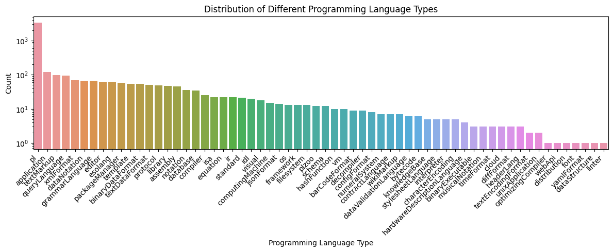

# Project of Data Visualization (COM-480)

| Student's name | SCIPER |
| -------------- | ------ |
|Feng Yiyang |352042 |
|Zhou Naisong |353331 |
|Tang Xuehan |353567 |

[Milestone 1](#milestone-1) • [Milestone 2](#milestone-2) • [Milestone 3](#milestone-3)

## Milestone 1 (23rd April, 5pm)

**10% of the final grade**

This is a preliminary milestone to let you set up goals for your final project and assess the feasibility of your ideas.
Please, fill the following sections about your project.

*(max. 2000 characters per section)*

### Dataset

In our data visualization project, we have chosen to utilize the [Programming Language Dataset (PLDB)](https://pldb.com/), which encompasses a comprehensive collection of 331 attributes for 4,304 distinct programming languages. The dataset primarily comprises fields such as title, country, type, rank, users, creators, and statistics pertaining to platforms like GitHub, Wikipedia, and Stack Overflow.

Upon conducting an in-depth exploratory data analysis, we have determined that the dataset boasts exceptional quality, characterized by a diverse range of both numerical and textual features. To effectively process text analysis tasks, we filter out symbols and extraneous non-textual notations. Moreover, data cleaning procedures like removing null values and formalizing data are conducted, ensuring the accuracy and reliability of our project outcomes.

### Problematic

Our data visualization project aims to elucidate the distribution characteristics and interrelationships of various programming languages. To effectively convey these insights, we have devised four primary visualization components:

- Temporal distribution: A timeline showcasing the emergence of programming languages over a specified range of years.
- Geographical distribution: A map highlighting the global distribution of programming languages.
- Word cloud: A graphical representation of the frequency and prominence of terms associated with different programming languages.
- Network visualization: A diagram illustrating the connections and associations between various programming languages.

Our data visualization project aims to present an engaging and intuitive view of the programming languages landscape, highlighting their temporal and geographical distributions, relevant terminology, and interconnections. Driven by a desire to enrich understanding and appreciation for the field's progression, we aim to engage programming language developers, software engineers, computer science students, educators, and technology enthusiasts in exploring the world of programming languages and their diverse impact.

### Exploratory Data Analysis

**Preprocessing**:

We processed the dataset in [milestone_p1.ipynb](milestone_p1.ipynb). We obtained the data from the PLDB database. The dataset contains information such as the programming language name, year of appearance, type, rank, fact count, last activity, example count, book count, and more. Before constructing the network, we first cleaned the data and prepare it for analysis. 

In detail, we cleaned the text column `wikipedia.summary` by removing stopwords, numbers, and punctuation. Also, we may need to standardize the column `country`, as they were represented in an informal manner in raw data. For example, both "USA" and "United State" refer to the "United States". Therefore, we replaced some confusing names so that the countries' names can be accepted by the function [pycountry.countries.get](https://pypi.org/project/pycountry/), which can retrieve uniform information about a country.

**Distribution of Different Programming Languages in a Range of Years or a Particular Year**

To explore when different programming languages occur, we created a bar chart for the years up to 1950 (excluding 1950) and a line chart for the years from 1950 onwards (including 1950).

From the figure, we can observe that the majority of programming languages emerged after 1950. Overall, there is an upward trend in the number of programming languages appearing per year. Interestingly, some programming languages have their origins far in the past, even dating back to ancient times (even before the Common Era, BC!). For instance, The Sumerian abacus appeared between 2700 and 2300 BC. It held a table of successive columns which delimited the successive orders of magnitude of their sexagesimal (base 60) number system.[1]

[1] Ifrah, Georges (2001). The Universal History of Computing: From the Abacus to the Quantum Computer. New York, NY: John Wiley & Sons, Inc. ISBN 978-0-471-39671-0.

**Distribution of Different Programming Languages in different countries**

To investigate the geographical distribution of programming languages, we aimed to display the number of programming languages originating in various countries on a map. To accomplish this, data cleaning described before was applied to standardize country names. Additionally, a programming language may be developed collaboratively by multiple countries. Therefore, we allocate a fraction, calculated as (1/the total number of countries contributing to its development), to each participating country.

As illustrated in the graph, the United States is responsible for the development of the majority of programming languages. Encouragingly, numerous countries across the globe have taken part in creating programming languages, making valuable contributions to the world.

**Word Cloud for each programming language**:

For simplicity, we selected the top 10 programming languages and show their word clouds.

The word cloud visualizations show the most frequent words in the summary of each programming language. The most common words, including the name and key features, provide insight into the defining characteristics of each language.

**Network indicating relations between different programming languages**:

To construct the network, we first treated programming languages with the same type as similar languages. We then added an edge between two languages if they share the same type. Before constructing the network, we first took a look at the distribution of types. We found that there were several different types of programming languages in the dataset, including general-purpose, web, and database. To visualize the distribution of different types, we created a simple bar plot that shows the number of programming languages for each type, in descending order.

From above, we could see the type has a skewed distribution. Most languages have the type "pl". So if we use simply use `type` as the similarity metric, we could see several separated cliques with a large cluster in the middle (pl language).

Then we created the network. For simplicity, we just showed the top 100 programming languages.

We could see the resulting network has a large central cluster of "pl" languages and several smaller separated clusters.

### Related work

We discovered the dataset on [kaggle](https://www.kaggle.com/datasets/sujaykapadnis/programming-language-database) which was updated for data analysis and visualization purposes, while the original dataset repository can be found [here](https://github.com/breck7/pldb). As of now, no existing applications of this dataset have been identified. 

Our primary inspiration for this project stems from our personal experiences, as well as the compelling data visualization stories presented during lectures. This is our first time utilizing this specific dataset.

## Milestone 2 (7th May, 5pm)

**10% of the final grade**

## Milestone 3 (4th June, 5pm)

**80% of the final grade**

## Late policy

- < 24h: 80% of the grade for the milestone
- < 48h: 70% of the grade for the milestone

